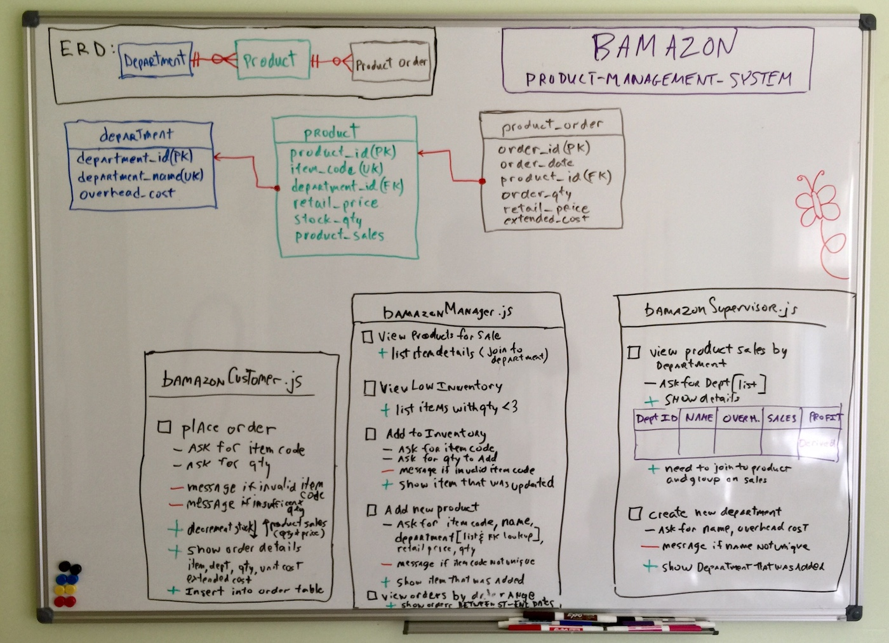

# Product-Management-System

## Node  & mySQL product ordering and management program

Utlizing Node.js, mySQL, javascript ES6, classes and npm packages

## Description

This node.js mySQL program simulates a retailer ordering and product management system leveraging mySQL database as backend product database.  Node inquirer command prompts allow for simulationg of product ordering, inventory and sales functions.app has command line interface for playing a hangman style game using the US President names as a word set.

## Details:

- #### Github project :    <a href="https://github.com/mylescarey2019/Product-Management-System">Product-Management-System Repository</a>

- #### For further development details see: 

  - ####  [UseCases and Psuedo Code](UseCases-PsuedoCode.md)

  - ####  [Test Cases](TestCases.md)

- #### Data Model & Design Whiteboard:

#### Example walkthru GIF :

## Getting Started

### Native and NPM Packages Used
1.  inquirer  - for interactive command line response 
2.  mysql - for database connectivity

### Dependencies

* none 

### Installing

* none necessary 

### Executing program

* open terminal session
  1. run program:   node bamazonCustomer.js
  2. run program:   node bamazonManager.js
  3. run program:   node bamazonSupervisor.js
  

#### Possible Enhancements

1. expand the data model by adding  order, order line item and order total tables
2. expand function to support multi item orders using above data model
3. add item code assignment stored procedure with simulated business rules instead of having user pick new item codes

## Authors

Myles Carey 
mylescarey2019@gmail.com 

## Version History

* 1.0 - Initial Release

## License

## Acknowledgments

Thanks to beta testers - my 15yo & 17yo daughters and wife 

