# Product-Management-System

## Node  & mySQL product ordering and management program

## Test Cases

Functionality Cases
1. bamazonCustomer

    1. exit	- expect program to exit to terminal

        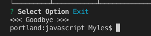

    2. see product list - expect product list to be displayed with items

        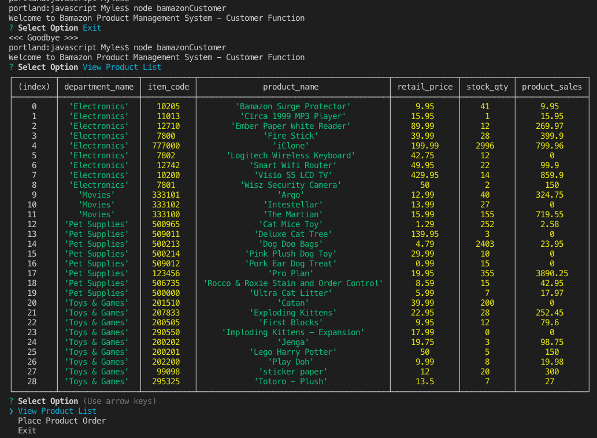

    3. see product list when no items exist - expect empty display grid 

        

    4. place order - item code does not exist - expect cancelled transaction

    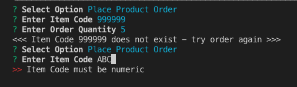

    1. place order - item code exists
        1. expect prompt for order quantity
            1. enter non-number - expect prompt for re-entry
            
               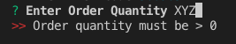
            
            2. enter 0 - expect prompt for re-entry
            
               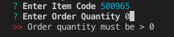
        2. valid order quantity entered
            1. order qty = on hand qty
                
                1. expect results showing order  and database reflects 0 on hand qty
                
                   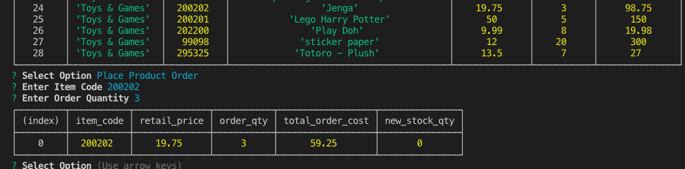
            2. order qty < on hand qty
                
                1. expect results showing order and database reflect on hand qty that has been decremented by order qty - return to initial prompt
                
                   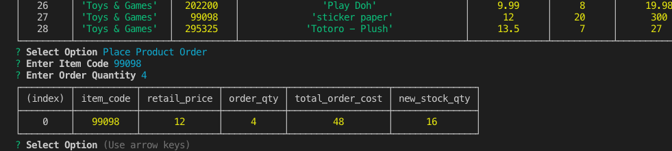
            3. order qty > on hand qty
                
                1. expect message Insuffient qty - return to initial prompt
                
                   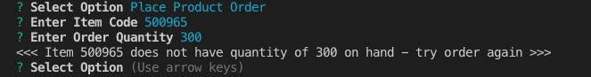

    

2. bamazonManager

    1. exit	- expect program to exit to terminal

    2. view products - expect list of products ordered by department name, product name - empty grid if no products

       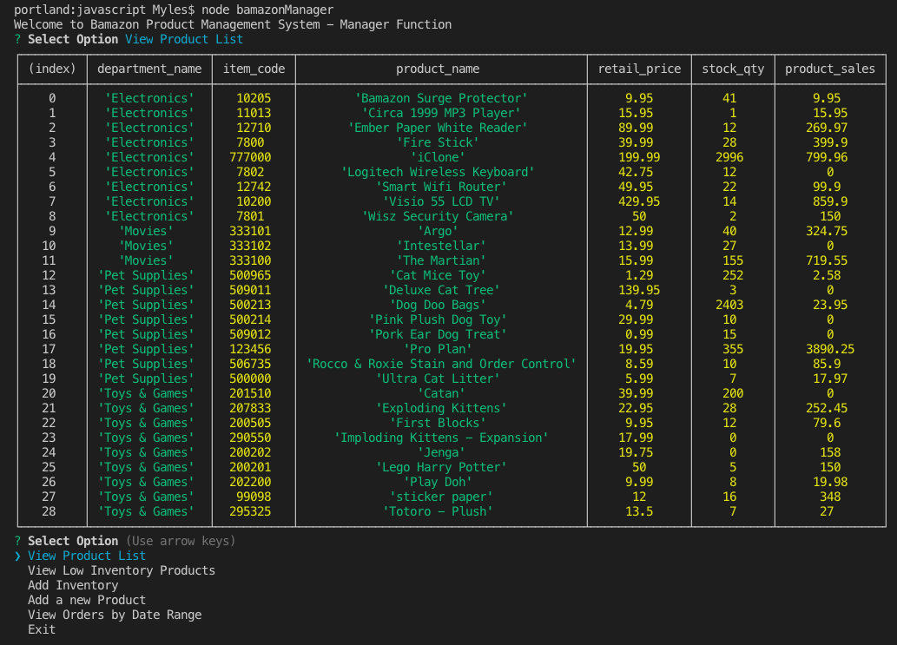

    3. view products low inventory - expect list of products ordered by department name, product name where on hand qty < 5 - expect empty grid if no products in low inventory status

       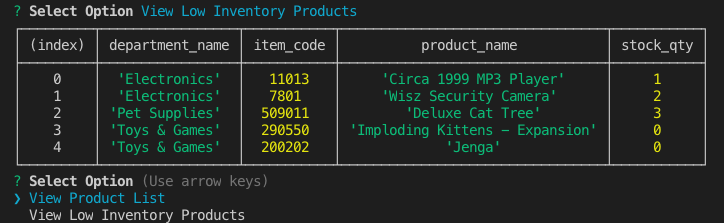

    4. update inventory - 

       1. prompted for item code  - expect prompt if not > 0

          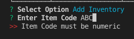

       2. prompted qty to add - expect prompt if not > 0

          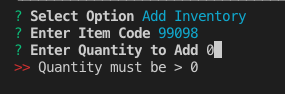

       3. test where item code does not exist - expect cancelled transaction / message

          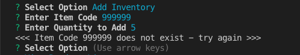

       4. test where item code exists - expect stock_qty of item to be updated with the added qty entered

          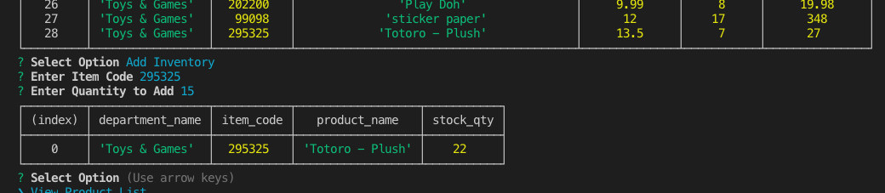

    5. add new product - 

       1. prompted for item code - expect prompt if not > 0

          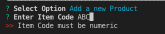

       2. prompted for product name - expect prompt if blank

          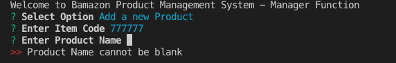

       3. must choose department from list 

          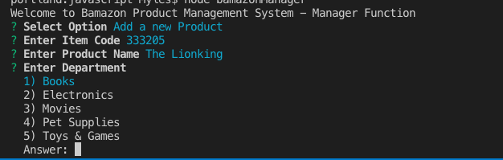

       4. prompted for retail price - expect prompt if not > 0

          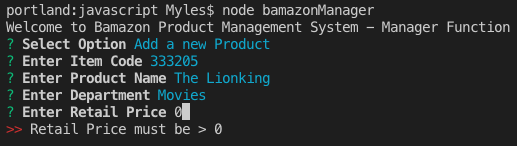

       5. prompted for stock qty - expect prompt if not numeric - will accept 0  - test with both cases

          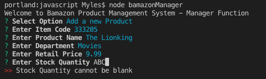

       6. entered existing item code - expect error message

          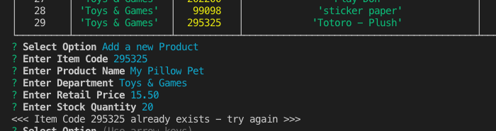

       7. entered valid properties for new item code - expect display of added product

          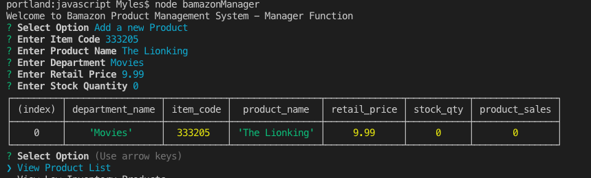

    6. view orders by date range

       1. prompted for start date - expect prompt if not date format

          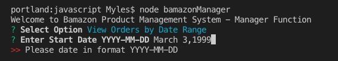

       2. prompted for end date - expect prompt if not date format

          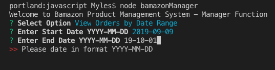

       3. all orders that have order_date within the start and end dates will be shown - sorted by department, order date, product name

          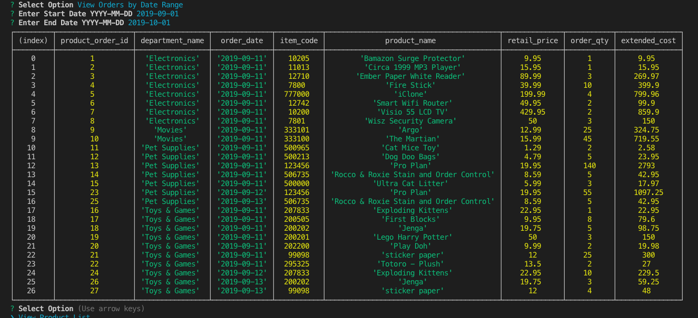

          

          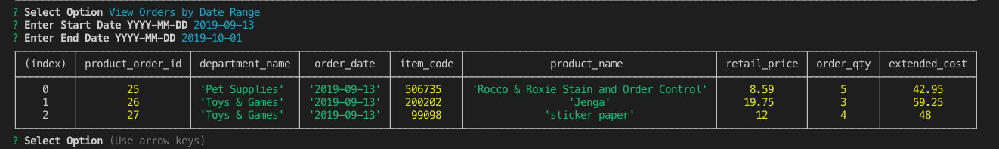

          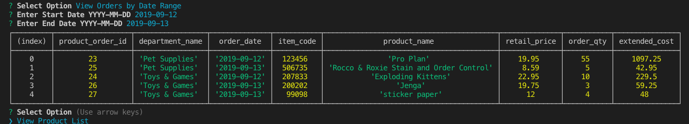

    ​            	

    

3. bamazonSupervisor

    1. exit	- expect program to exit to terminal

    2. view department sales - will show all department sales

       1. if department has no items then will still have line in output but will have null for sales and profit

       2. total profit reflects the department's overhead cost - SUM( of the sales of all item from the given department)

          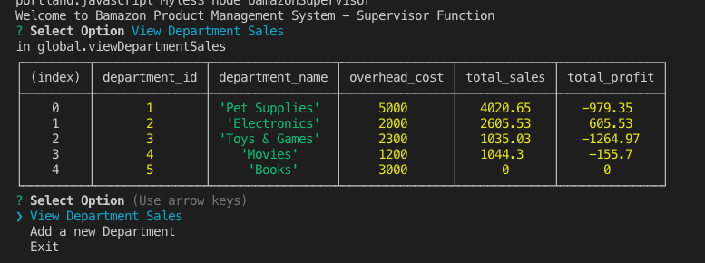

          - Note:  Books department has no products yet  - use of OUTER LEFT JOIN and CASE ISNULL in select ensured it still appears on the results 

            ```mysql
            SELECT d.department_id 
            	  ,d.department_name 
            	  ,d.overhead_cost AS overhead_cost
            	  ,CASE 
            	     WHEN ISNULL(SUM(p.product_sales)) THEN 0 
            		   ELSE SUM(p.product_sales) 
            	   END AS total_sales 
            	 ,CASE 
            		  WHEN ISNULL(SUM(p.product_sales) - d.overhead_cost) THEN 0 
            	  	ELSE SUM(p.product_sales) - d.overhead_cost 
            	  END AS total_profit 
            FROM department AS d 
            LEFT OUTER 
            JOIN product AS p 
              ON p.department_id = d.department_id 
            GROUP BY d.department_id 
            	    ,d.department_name 
            	    ,d.overhead_cost
            ```

          - seperate validation check - products with Movie Department - sales sum to 1,044.30

          ```mysql
          use bamazon; 
          --  show department
          SELECT *
            FROM product AS P
           where p.department_id = 4
          ```

          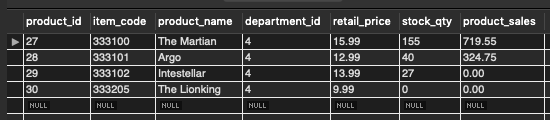

         

       - Add a big sales to Pet Supplies - 

         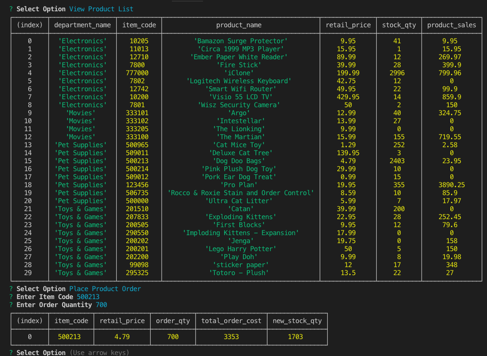

       - Results evident in Department sales report - old sales = 4020.65 + new sale of 3353.00 = total sales of 7373.65

         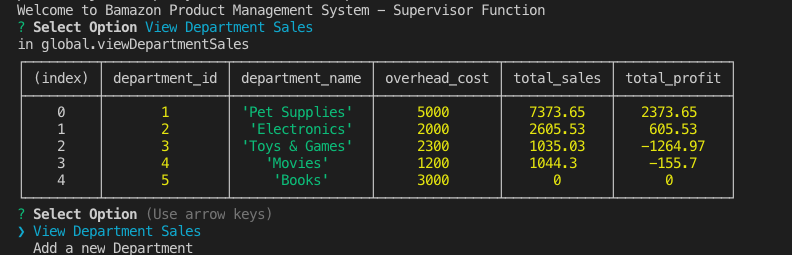

       

    3. add new department - 

       1. prompted for department name - expect prompt if blank

          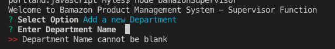

       2. prompted for overhead cost - expect prompt if not > 0

          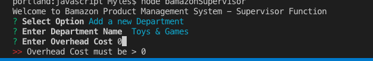

       3. if department name exists - expect the transaction to be cancelled

          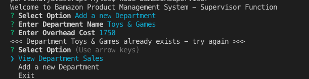

       4.  enter new department name and overhead cost > 0 - expect new department to be added

          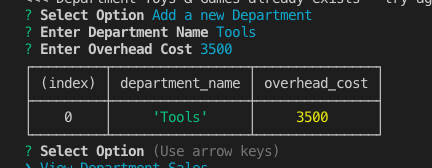

       5. now show Department report, then add an item to the new department,  place an order, show order, show department report again:

          ​		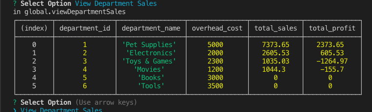

     

    ​					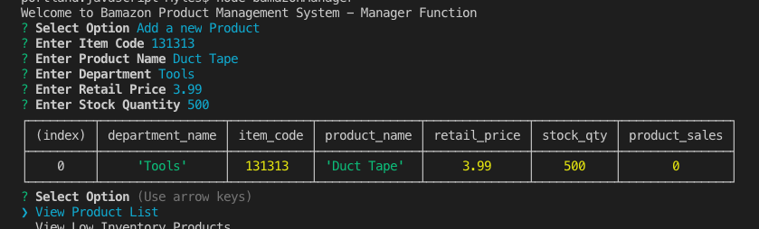

    ​		

    ​				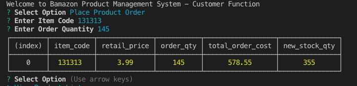

    ​			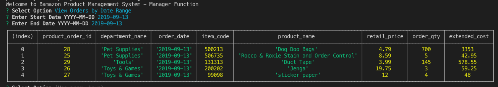

    ​	

    ​	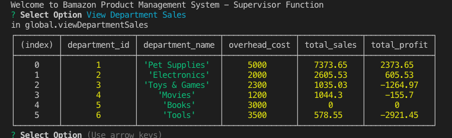