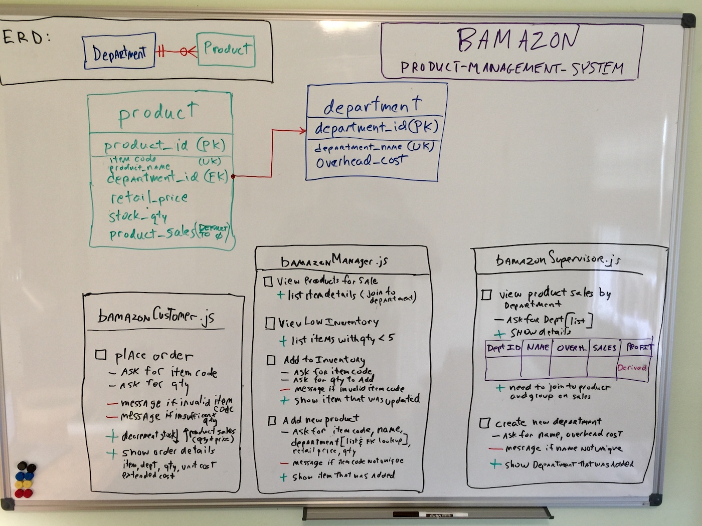

# Product-Management-System

## Node  & mySQL product ordering and management program

## Description

This node.js mySQL program simulates a retailer ordering and product management system leveraging mySQL database as backend product database.  Node inquirer command line prompts which allow for simulation of product ordering, inventory and sales reporting functions.  

## Database and Function Design

### Database Model

1. Database model consists of department and product entities with a one to many relationship 

   - a department has 0 to many products
   - a product has 1 department

2. tables are named "department" and "product"

   - surrogate keys using identity columns are the primary keys for the tables:  department_id and product_id.  Using surrogate keys can have advantages such as ease and speed of tables joins, key permanence allowing alternate key or natural key to change, migration of keys to linkage/junction tables when many to many relationships become necessary (for exanple:  orders to items yielding an item-order linkage table) 

   - item_code has been added to the product table as it is common to have an alterate key for ordering that in some instances can have business intellegence encoded (item code ranges for instance).  item code has a unique index
   - product table has a foreign key: department_id to link it to the department table
   - product_sales on the product table has a default value of 0
   - deparment_name on department table has a unique index

### System Functions

1. Customer

   - module allows user to place order by entering item code & quantity
     - item code is validated to ensure it exists and ordered quantity is checked against on-hand quantity
     - following successful order the on-hand qty is decremented and user is shown order detail recap

2. Manager

   - module allows user to perform multiple functions:
     1. view list of products for sale
     2. view list of products with low inventory
     3. add inventory to an item - enter item code and quantity; item code is validated to ensure it exists
        - on hand quantity in incremented and report of updated item is shown
     4. add new item - user enters attributes for a new item
        - item code is validated - it must be unique;  after successful entry report of new item is shown

3. Supervisor

   - module allows user to:

     1. view product sales and profit grouped by department
     2. add new department - user enters attributes for new department

     - department name is validated - must be unique; after successful entry report of new department is shown

## User Stories / Use Cases

1.  user starts bash session and runs either Customer, Manager or Supervisor js files

2.  bamazonCustomer
  
    1.  user is presented with initial prompt with options:  "See Product List", "Place order", "Exit"
    2.  "See Product List"
        1.  list is displayed: department name, item code, product name,  retail price of item, on hand quantity and product sales
    3.  "Place Order"
        1.    user is prompted to:
            1.  "Enter Item Code"
            1. item code is validated - must be numeric
            2.  "Enter Order Quantity"
                1. order quantity is validated - must be numeric and > 0
        2.  Order  is validated 
            1. if item code does not exist or ordered qty is > on hand qty user is informed "Item does not exist"  or "Insufficent on-hand quantity, on-hand"
                1. return to initial prompt
            2. if order qty <= on hand qty then on-hand qty is decremented by order qty
                1. user is shown message "Successful Order item code: <item code>, quantity <qty> total cost = <computed cost>"
                2. return to initial prompt 
    4.  "Exit" - program exits to terminal
    
3. bamazonManager

    1. user is presented with initial prompt with options: "View Products", "View Low Inventory Products", "Update Inventory", "Add a new Product", "Exit"

    2. "View Products"

        1.  product list is display ordered by department name, product_name
            1.  list appears in table form:  department name, item code, product name,  retail price of item, on hand quantity and product sales

    3. "View Low Inventory Products"

        1.  product list is displayed for all items with stock_qty < 5
            1.  list appears in table form:  department name, item code, product name,  retail price of item, on hand quantity and product sales
            2.  return to initial prompt

    4. "Update Inventory"

        1.   user is prompted to:
           1. "Enter Item Code"
              1. item code must be numeric > 0
           2. "Enter Quantity to Add "
              1. Quantity is validated - must be numeric and > 0
        2. Validation - if item code does not exist or add qty not > 0 transaction is cancelled
        3.   Message displayed the product and updated quantity:  Department Name, Product Name Retail Price, Old Quantity, New  Quantity, Product Sales
        4.   return to initial prompt

    5. "Add a new Product"

        1.  user is prompted for:
            1.  "Enter Item Code"  - is validated must be numeric > 0
            2.  "Enter Product Name" - is validated, cannot be null - user prompted to re-enter if not
            3.  "Choose Department" (SQL join to department table will present list of valid choice)
            4.  "Enter Retail Price" - is validated, must be numeric > 0 - user prompted to re-enter if not
            5.  "Enter Stock Quantity" - is validated, must be numeric, can be 0 - users prompted to re-enter if not
        2.  Validation - if item code already exist the transaction is cancelled
        3.  Message showing new Product is shown: Department Name, Product Id, Item Code, Product Name, Retail Price, Stock Quantity, Product Sales
        4.  return to initial prompt

    6. Exit" - program exits to terminal

        

4. bamazonSupervisor
    1. user is presented with initial prompt with options: "View Departement Sales", "Add new Department", "Exit"

    2. "View Department Sales"

       1. user is prompted to:
          1. "Choose Department" (SQL join to department table will present list of valid choice)
          2. Results shown:  Department Id, Department Name, Overhead Cost, Department Sales, Profit
          3. - Department Sales is a computed value: SQL join to product table for given department and compute SUM(product.product_sales)
             - Profit is a computed value:  SQL join to product table for given department and compute Overhead cost - SUM(product.product_sales)
       2. return to initial prompt

    3. "Add new Department"

       user is prompted for:

       1. "Enter Department Name"  - is validated, cannot be null - user prompted to re-enter if so
       2. "Enter Overhead Cost" - is validated, must be numeric > 0 - user prompted to re-enter if not
       3. Message showing new Deparment is shown: Department Id, Department Name, Overhead Cost 
       4. Validation - if department name already exists - transaction is cancelled
   5. return to initial prompt
    
    4. Exit" - program exits to terminal

### Psuedo Code - details TBD

1. bamazonCustomer.js 
    1. TBD
2. bamazonManager.js
       1. TBD
  
2. bamazonSupervisor.js
    1. TBD
